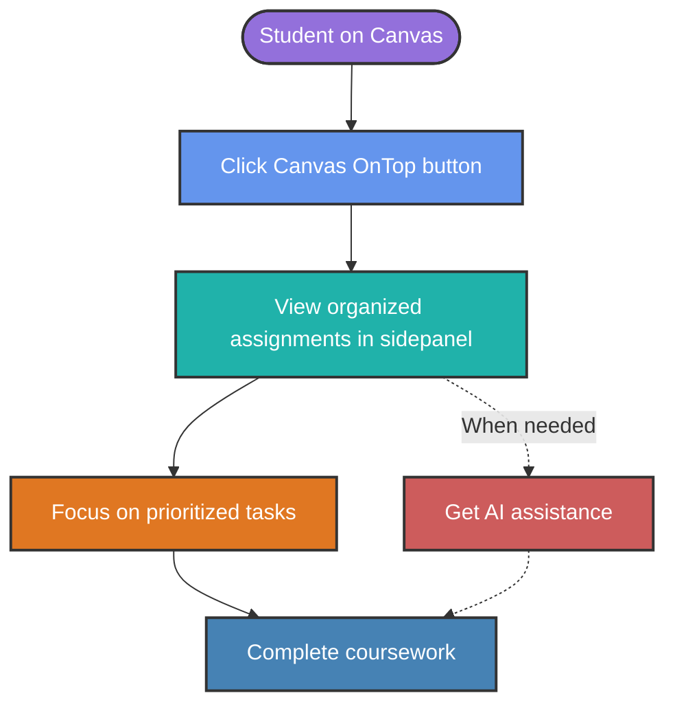
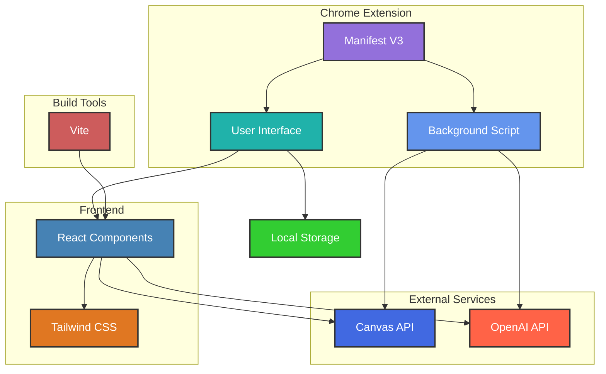

# Canvas OnTop

[](https://opensource.org/license/mit/)
[](https://github.com/neevs-io/canvas-ontop/releases/tag/v1.0.0)
[](https://react.dev/)

**AI-powered Chrome extension for enhanced Canvas LMS course management**

<div align="center">

</div>


## 🚀 Quick Start

```bash
# Clone the repository
git clone <repository-url>
cd canvas-on-top

# Install dependencies
npm install

# Build the extension
npm run build

# Load in Chrome:
# 1. Open chrome://extensions/
# 2. Enable "Developer mode"
# 3. Click "Load unpacked" and select the dist folder
```

## 🔍 The Problem

College students using Canvas LMS often struggle with:
- Managing assignment deadlines across multiple courses
- Prioritizing competing academic tasks
- Accessing insights that could help improve their learning experience

## 💡 Our Solution

Canvas OnTop seamlessly integrates with Canvas to provide AI-driven organization and insights:



## ✨ Key Features

- **AI-Driven Insights**: Personalized weekly focus messages and actionable tips powered by OpenAI's GPT-4o-mini
- **Deadline Management**: Real-time tracking of assignments and discussions due within a fixed weekly window
- **User-Friendly Interface**: Sleek side panel with draggable floating button for seamless integration

## 🛠️ Technical Architecture

Canvas OnTop is built with a modern technical stack:



### Tech Stack

| Category | Technologies |
|----------|-------------|
| **Frontend** | React, Tailwind CSS |
| **APIs** | Canvas API, OpenAI API (GPT-4o-mini) |
| **Build** | Chrome Manifest V3, Vite |
| **Storage** | Chrome Local Storage |
| **Dependencies** | `react`, `react-dom`, `react-markdown`, `lucide-react` |

## 📋 Detailed Features

### Canvas API Integration
- Secure OAuth2 authentication
- Fetches courses, assignments, and discussions
- Real-time data synchronization

### Weekly Dashboard
- Shows upcoming and overdue tasks
- Intuitive navigation between weeks
- Visual indicators for priority items

### AI Suggestions
- Personalized task recommendations
- Study tips based on course patterns
- Custom insights for discussions

### Offline Support
- Local storage caching
- Works without constant API calls
- Syncs when connection is restored

## 💻 Installation and Setup

### Prerequisites
- Chrome browser (v88+)
- Node.js (v16+)
- npm (v7+)

### Development Setup
1. Clone the repository:
   ```bash
   git clone <repository-url>
   cd canvas-on-top
   ```

2. Install dependencies:
   ```bash
   npm install
   ```

3. Run in development mode:
   ```bash
   npm run dev
   ```

4. Build for production:
   ```bash
   npm run build
   ```

### Loading in Chrome
1. Open Chrome and navigate to `chrome://extensions/`
2. Enable "Developer mode" (toggle in top-right)
3. Click "Load unpacked" and select the `dist` folder

## 🔧 Configuration

After installation, you'll need to configure:

1. Open extension options (right-click extension icon → Options)
2. Enter your Canvas API URL (e.g., `https://yourschool.instructure.com`)
3. Add your Canvas API token ([How to generate a token](https://community.canvaslms.com/t5/Admin-Guide/How-do-I-manage-API-access-tokens-as-an-admin/ta-p/89))
4. Add your OpenAI API key (optional, for AI features)

## 👥 Team

This project was developed as part of ITC4850 Information Technology Project (Spring 2025) at Northeastern University CPS.

| Name | Role |
|------|------|
| **Jackson Gray** | Project Manager |
| **Jonas De Oliveira Neves** | Technical Lead |
| **Shaun Donovan** | Documentation/Quality Lead |
| **Prof. Kurt Brandquist** | Faculty Sponsor |

## 🤝 Contributing

We welcome contributions!

## 📄 License

This project is licensed under the MIT License - see the [MIT License](https://opensource.org/license/mit/) for details.

---

<div align="center">
© 2025 Canvas OnTop Team @ Northeastern University
</div>
